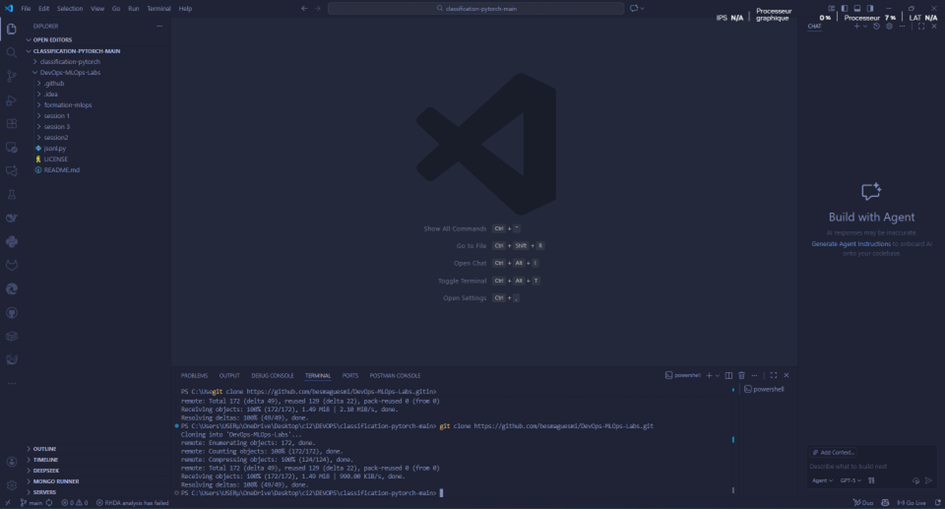
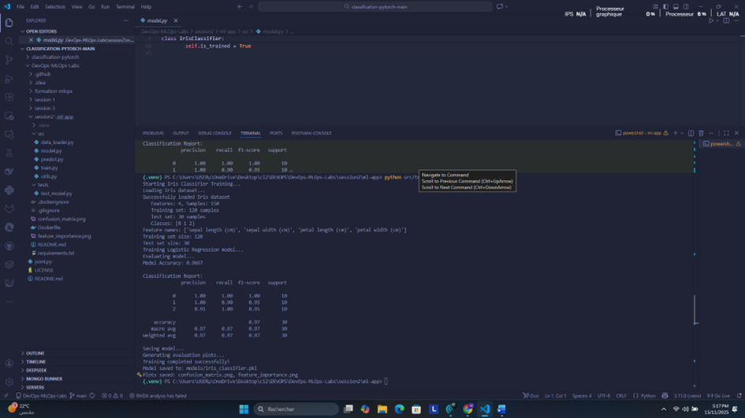
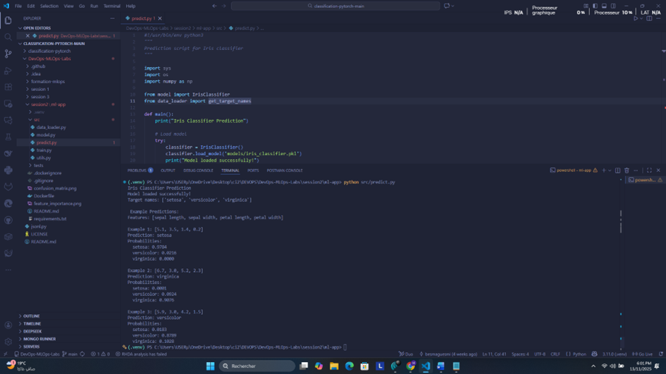
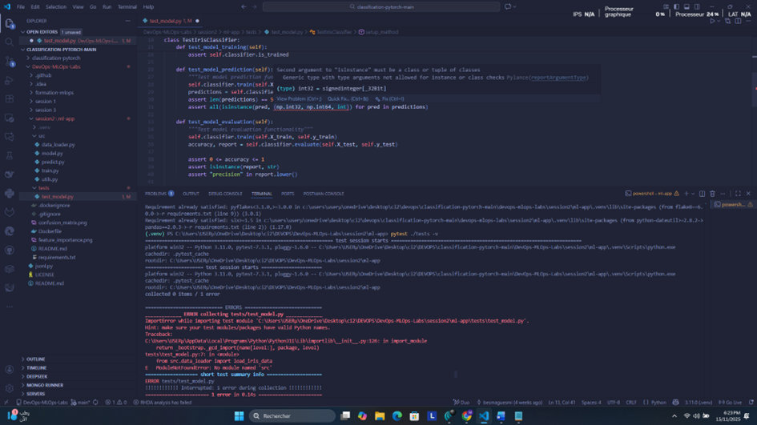
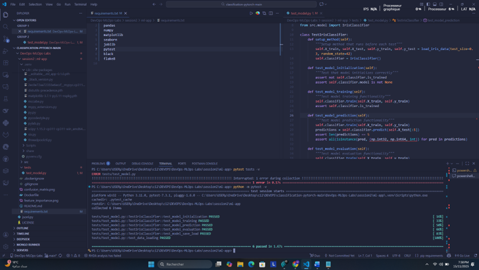
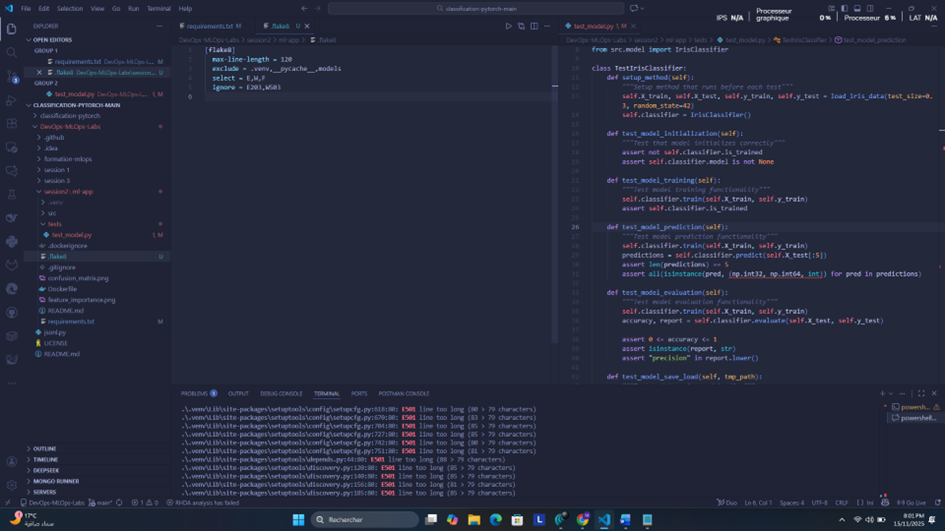
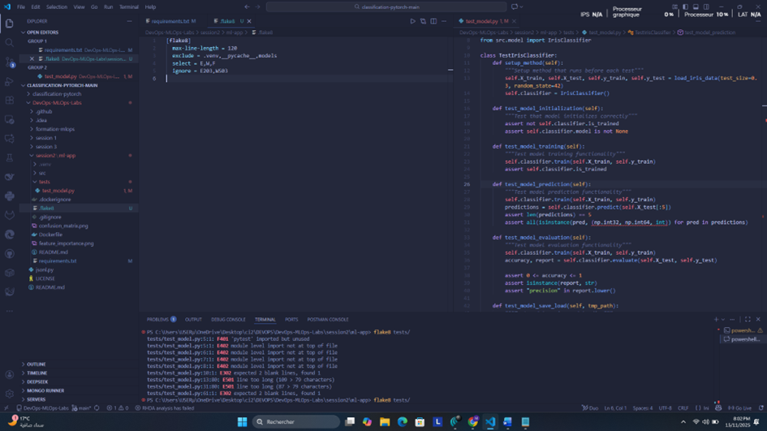
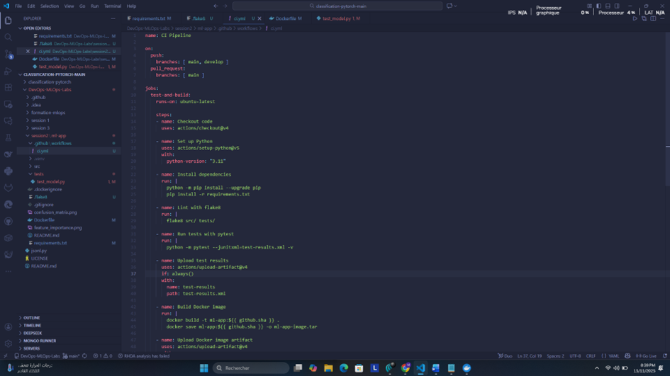
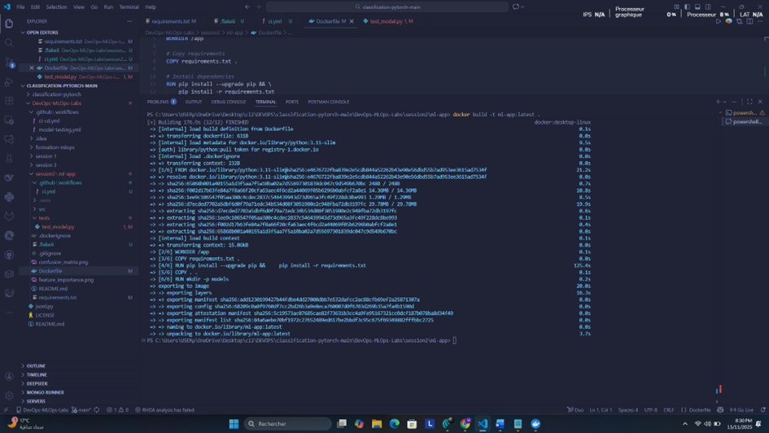
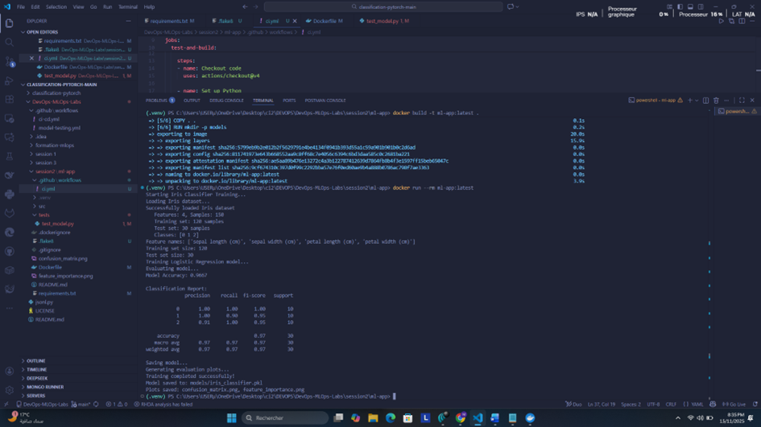

# DevOps Assignment Report

**Student Name:** Mohamed amine Trabelsi 
**Date:** November 15, 2025  
---

## Task 1: Prepare the ML Project

### What I Did:
1. **Forked the repository** from the source repository
2. **Inspected the repository structure** to verify all necessary files exist
3. **Verified requirements.txt** is present in the `DevOps-MLOps-Labs/session2/ml-app/` directory





## Task 2: Run the App Locally

### What I Did:
1. **Created a virtual environment** using Python 3.11


2. **Installed all dependencies** from requirements.txt


3. **Ran the training script** 



4. **Verified the model was saved** successfully




## Task 3: Write Unit Tests

Already Present:

- `tests/test_model.py` includes multiple tests (initialization, training, prediction, evaluation, save/load, data loading).

### Tests Implemented:
The `tests/test_model.py` file includes 6 comprehensive tests:

1. **test_model_initialization** - Verifies the IrisClassifier initializes correctly with default state
2. **test_model_training** - Checks that the model trains successfully and updates its trained status
3. **test_model_prediction** - Tests prediction functionality on test data
4. **test_model_evaluation** - Validates model evaluation returns accuracy and classification report
5. **test_model_save_load** - Tests model persistence (save/load) and prediction consistency
6. **test_data_loading** - Verifies data loading returns correct shapes and class distribution

### Error:
Second argument to "isinstance" must be a class or tuple of classes
Generic type with type arguments not allowed for instance or class checksPylancereportArgumentType



### Solution Applied:

•	Used the latest version in requirement.txt

•	I used  the command “python -m pytest -v” instead of “pytest”

### Test Results:





## Task 4: Linting & Formatting

### What I Did:
1. **Created .flake8 configuration file** in `session2/ml-app/` directory
2. **Ran flake8 on tests/** to identify style violations
3. **Fixed all linting errors** to meet PEP 8 standards

### Flake8 Configuration (.flake8):




### Fixes Applied:
1. **Removed unused import** - Deleted `import pytest` (not being used in tests)
2. **Removed manual path manipulation** - Deleted `sys.path.append()` lines (handled by conftest.py)
3. **Fixed import order** - Moved all imports to the top of file
4. **Added proper spacing** - Added 2 blank lines before class and function definitions per PEP 8
5. **Fixed long lines** - Split lines exceeding 79 characters:
   - Wrapped `load_iris_data()` call with multiple arguments
   - Split `isinstance()` check across multiple lines
6. **Removed trailing blank line** - Cleaned up file ending

### Final Result:



## Task 5: GitHub Actions CI Workflow

### What I Did:
1. **Created CI workflow file** at `session2/ml-app/.github/workflows/ci.yml`
2. **Configured the workflow** to run on push and pull_request events
3. **Implemented all required CI steps** using official GitHub Actions



### What the CI Workflow Does:

Every time code is pushed or a PR is created, GitHub automatically:
-  **Checks code formatting** - Ensures code follows PEP 8 style guidelines
-  **Runs all unit tests** - Validates functionality hasn't broken
-  **Builds Docker container** - Creates deployable container image
-  **Saves artifacts** - Stores test results and Docker image for download


## Task 6: Containerise the App

### What I Did:
1. **Updated existing Dockerfile** in `session2/ml-app/` directory
2. **Built the Docker image** successfully
3. **Ran training in containerized environment** to verify functionality

### Build and Run Commands:

# Build Docker image
docker build -t ml-app:latest .



# Run training in container
docker run --rm ml-app:latest




### Runtime Results:
- ✅ Training completed successfully in container
- ✅ Model accuracy: ~96.67%
- ✅ Model saved to `/app/models/iris_classifier.pkl`
- ✅ Plots generated successfully

---

### How to Run Locally:

**Prerequisites:**
- Python 3.11
- Docker Desktop (for containerization)
- Git

**Setup Steps:**
```powershell
# Clone repository
git clone https://github.com/besmaguesmi/DevOps-MLOps-Labs.git
cd DevOps-MLOps-Labs/session2/ml-app

# Create and activate virtual environment
python -m venv .venv
.venv\Scripts\Activate.ps1

# Install dependencies
pip install -r requirements.txt

# Run tests
python -m pytest -v

# Run linting
flake8 src/ tests/

# Train model
python src/train.py

# Build Docker image
docker build -t ml-app:latest .

# Run in container
docker run --rm ml-app:latest
```

**End of Report**
