## Rapport de Projet: DevOps-MLOps
**Auteur** : Yasmine Chakroun  **Date** : 14/11/2025

#### 1.Introduction
This documents reports the steps used to fork a repo, clone it, modify it locally, create a CI/CD to automate tests and to containerize a model using a built docker image.

#### 2.Tasks
##### a. Task 1: Prepare the ML Project
I forked the repository and had an independent copy of it on my GitHub account. 
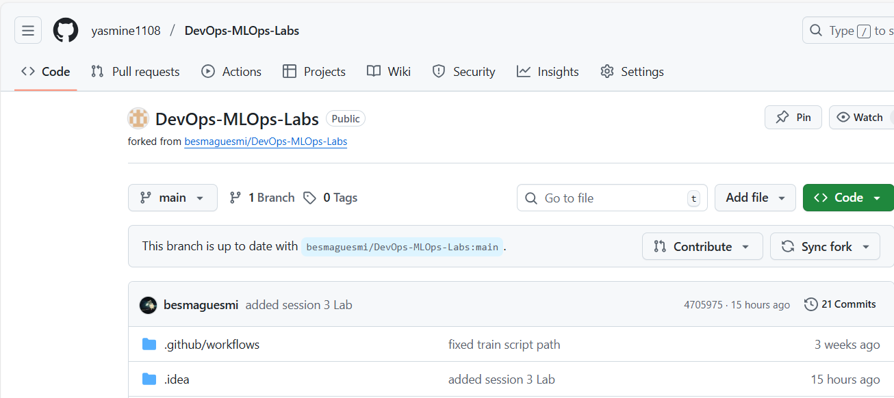
I then cloned the repository from my github account using the command **git clone <url/of/the/repo>**, to have a copy of the repo locally.
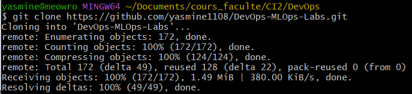
Finally, I added the original repository as my upstream repository, so I can pull any updates and make pull requests using the command **git remote add upastream <url/to/the/original/repo>**.
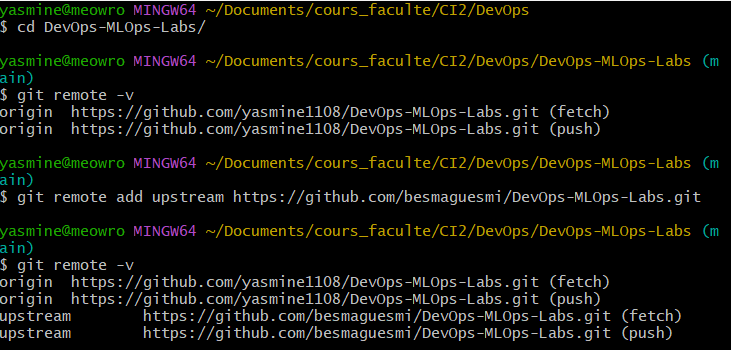
##### b. Task 2:  Run the app locally
I changed my working directory inside of the project directory. I then created a virtual environment, named it *.venv* and activated it. That way, the project environment does not affect the global environment of my pc in case I need to download dependencies or libraries.

**Remark**: I had to upgrade the versions of the libraries in the *requirements.txt* file as my system doesn't have the right tools to install them. As I have noticed that upgrading the versions didn't raise any errors or conflicts in the running of the app, I decided to proceed with that solution.
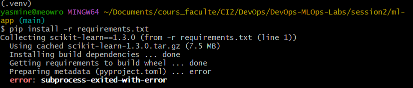
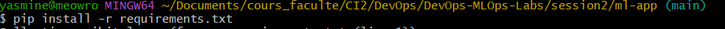
To run the app, we have to activate the virtual environment, and then run the command **python src/train.py**. This script will train the model, test it against some data, print a confusion matrix and save it under the folder *./models*.
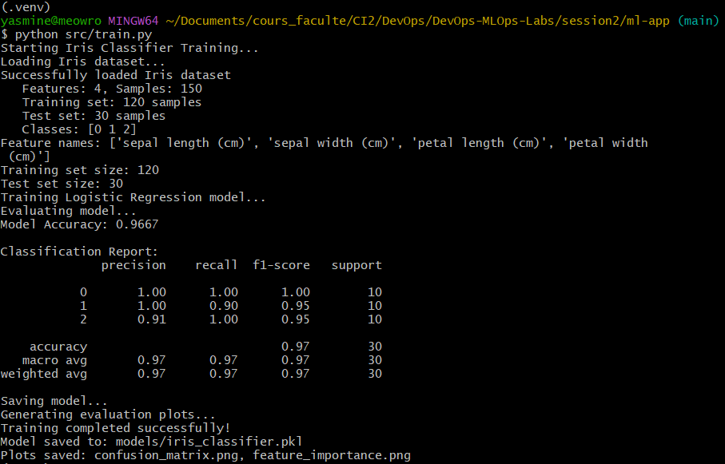
##### c. Task 3: Write unit tests 
I used the *./tests/test_model.py* file as it has convincing tests. Ro ensure the tests run locally, I used the command **python -m pytest ./tests/test_model.py**. The 6 tests are passed.
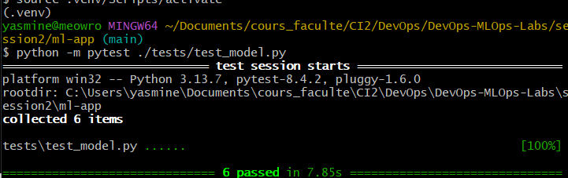
##### d. Task 4: Linting & formatting 
Linting is a tool that analyzes source code to flag programming errors, bugs, stylistic errors, and suspicious constructs. Here I used flake8 to ensure  the code meets basic style checks. As we can see the code only has minor errors that can be overlooked.
PS: I used --ignore E501 flag as it is a minor error that is repeated many times so it crowds the output.
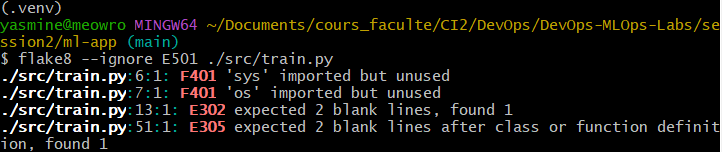
##### e. Task 5: GitHub Actions CI workflow 
We implemented a GitHub Actions workflow that triggers *on: push* and *on: pull_request*.
The main jobs of the workflow are:
- Checkout: Checking out the source code.
- Setup Python: Installing the Python environment.
- Install Dependencies: Installing packages from requirements.txt.
- Run Linter: Checking code quality with flake8.
- Run Tests: Running tests with pytest and generating a report.
- Upload test report: Create and save the test report as an artifact.
- Build & Upload Image: Building the Docker image and saving it as an artifact.
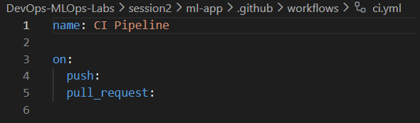
To test the correct functioning of the workflow, I used on a push. I started by staging my changes using the command **git add .** and then I committed the changes using **git commit** and finally pushed the changes to the remote repository using **git push**. In github, we can see the CI/CD workflow is working and it terminated correctly, we can also see the artifacts it saved: the report and the docker image.
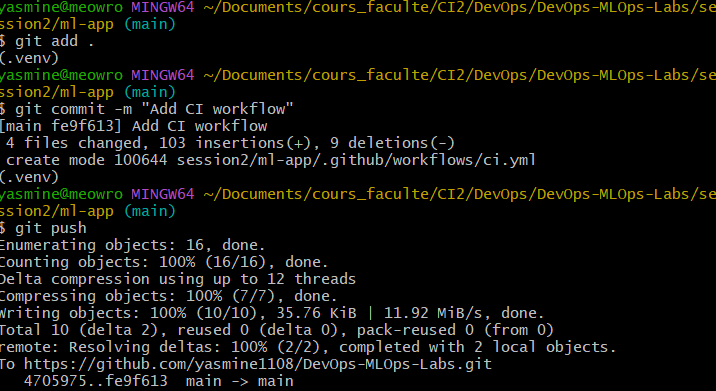
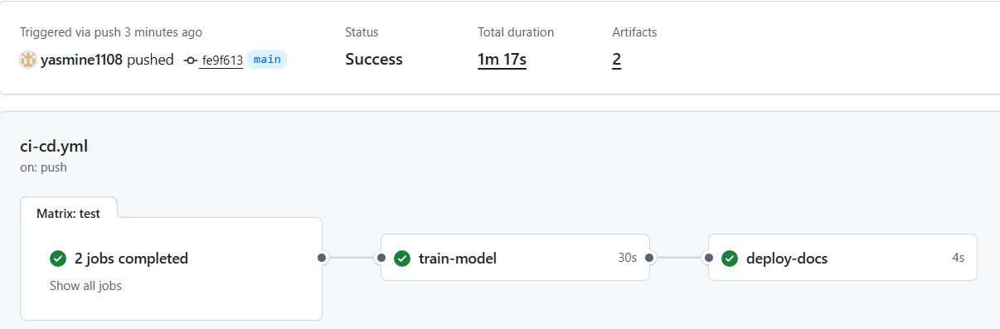
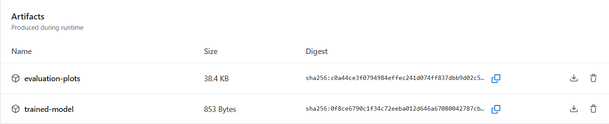
##### f. Task 6: Containerise the app
I started by building the Docker Image using the existing Dockerfile and the command **docker build -t my-ml-app**. I gave it the tag my-ml-app so it is easier to use it later.
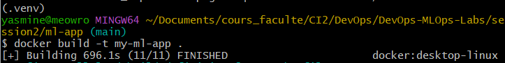
Once the image is built, I run it and kept the command by default for the CMD which is **python src/train.py** to train and print the confusion matrix and save the model under */app/models* and the images of the *confusion_matrix.png* and *feature_importance.png* under the */app* folder. For that I mapped the volume using **-v** flag. I mapped the local *ml-app* folder to the */app* folder. I expose it the port 1234 using the flag **-p 1234:1234**. And lastly, I used the flag **--rm** to delete the container once it is stopped to optimize the space.
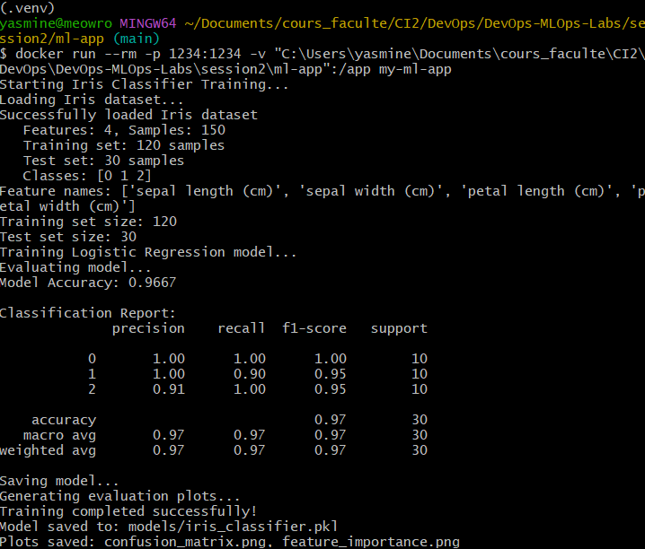
#### 3.Conclusion
From this assignment, I learned to fork a repo, clone it, test the code locally, use linting tools, write CI pipeline to run it on push and pull and containerize and run the app in a Docker container.