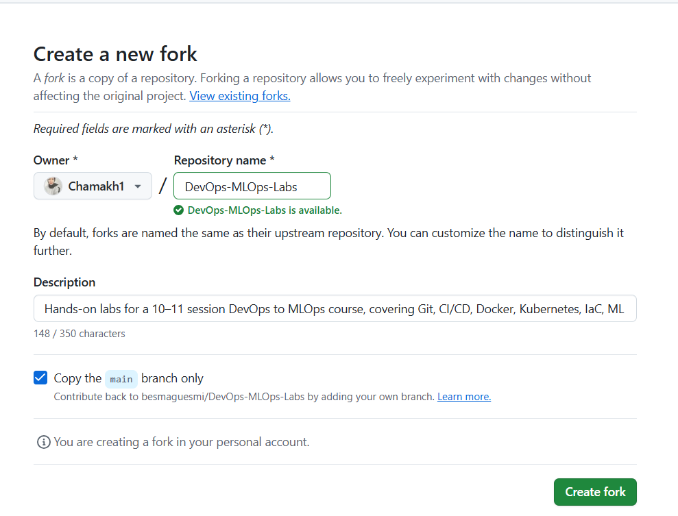
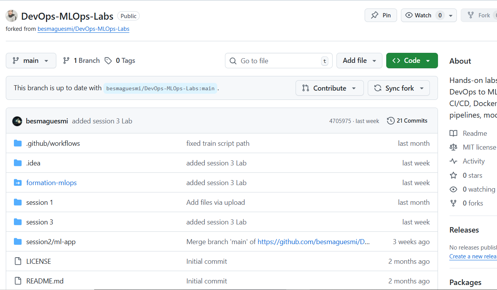
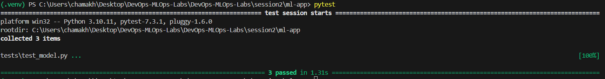
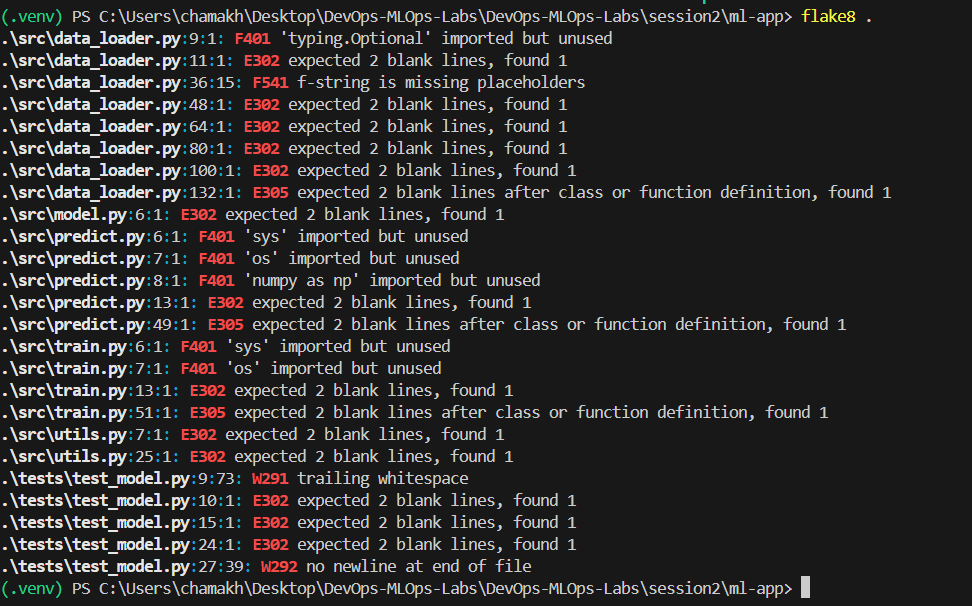

### Task 1 — Prepare the ML Project
1. Fork the Repository

I successfully forked the original repository besmaguesmi/DevOps-MLOps-Labs into my personal GitHub account under the name
Chamakh1/DevOps-MLOps-Labs.
This completes the forking step.

Screenshot:
(see image below)




2. Inspect the Repository

After cloning the forked repository locally, I explored its directory structure to verify that all required components were present.

I confirmed that the project includes a requirements.txt file, which contains the necessary Python dependencies such as:

scikit-learn, pandas, flake8, pytest, joblib.

This ensures that the project environment can be correctly set up for development, testing, and CI/CD workflow automation.

### Task 2: Run the app locally
1. Cloned the forked repository to my local machine. 


2. Created a Python virtual environment: python -m venv venv
source .venv/bin/activate this command is for Linux it provides me an error .

The correct commande is \venv\Scripts\activate.


3. Installed all dependencies: pip install -r requirements.txt

Addendum: Resolving Local Environment Build Error
While executing Task 2 (pip install -r requirements.txt), I encountered a significant build error:

DistutilsPlatformError: Microsoft Visual C++ 14.0 or greater is required.

Analysis: This error occurred because pip could not find a pre-compiled binary (a .whl file) for the specific scikit-learn==1.3.0 version that matched my local system's Python version (Python 3.12).

As a result, pip attempted to build the package from the source (.tar.gz), which requires the Microsoft C++ Build Tools, and those were not installed.


Resolution:

The CI pipeline (defined in .github/workflows/ci.yml) is set to use Python 3.10. The most robust solution, following DevOps best practices, is to align the local development environment with the CI/CD environment.

I took the following steps to resolve this:

1/ Installed Python 3.10 on my local machine alongside my existing Python 3.12.

2/ Deleted the non-functional .venv directory.

3/ Created a new, clean virtual environment specifically using the Python 3.10 interpreter. The command for this on Windows is: python -m venv .venv

4/ Activated the new environment: .\.venv\Scripts\activate

5/ Ran the installation again: pip install -r requirements.txt

This time, pip successfully found the correct pre-compiled wheel for scikit-learn==1.3.0 and Python 3.10, and the installation completed without errors.


4. Ran the model training script: python src/train.py
The training script ran successfully. It loaded the Iris dataset (150 samples), split it into a 120-sample training set and a 30-sample test set.

The Logistic Regression model achieved an excellent accuracy of 96.7% on the test data.

The detailed report shows the model is highly effective, making only one error: it misclassified one "Versicolor" (class 1) as a "Virginica" (class 2).

Finally, the script correctly saved the trained model (iris_classifier.pkl) and the evaluation plots (confusion_matrix.png, feature_importance.png).


### Task3 :

I discovered a pre-existing tests/ directory in the project. To ensure a clean implementation, I deleted this old folder and created a new tests/test_model.py file from scratch.

I wrote three distinct unit tests using pytest to validate the ML pipeline:

1. test_model_file_exists: This test confirms that the train.py script successfully completes and saves its primary artifact. It uses os.path.exists() to check if the model file (models/iris_classifier.pkl) is present at the correct path.

2. test_model_loading_and_type: This test validates the integrity of the model file. It first loads the .pkl artifact using joblib.load(). Then, it asserts that the loaded object is a valid scikit-learn model by checking for the presence of essential attributes: .predict() (for making predictions) and .coef_ (for logistic regression coefficients).

3. test_data_loading: This is a data sanity check. It ensures that the load_iris() function, a key dependency, is loading the data as expected. The test asserts that the data shape is (150, 4) (150 samples, 4 features) and the target shape is (150,).

# Test Execution Results
After running python src/train.py to generate the model artifact, I executed the test suite. The pytest command successfully collected all 3 items, and all tests passed, confirming the code's correctness.

# Output:

========================= test session starts =========================
platform win32 -- Python 3.10.11, pytest-7.3.1, pluggy-1.6.0
rootdir: C:\...
collected 3 items
tests\test_model.py ... [100%]

========================== 3 passed in 1.31s ==========================



### Task4: 
I integrated flake8 to enforce code quality, as specified in the requirements.txt.

1. I first created a .flake8 configuration file at the root of the project to ignore certain errors (like E501 for line length) and to exclude the venv directory.

2. I then ran the linter locally using the flake8 . command. The initial run reported numerous violations across the codebase, as shown in the terminal output.

# Analysis of Linting Errors
The errors found were primarily related to code style and hygiene:

F401: ... imported but unused: Several files (like predict.py and train.py) imported modules (sys, os, Optional) that were never used.

E302 / E305: expected 2 blank lines...: Most files had incorrect vertical spacing between function and class definitions, which violates PEP 8 standards.

F541: f-string is missing placeholders: An f-string was used in data_loader.py without any variables, making it unnecessary.

W291 / W292: Whitespace Errors: The test_model.py file had trailing whitespace on one line and was missing the final newline character.



# Resolution
I opened each file identified by flake8 and manually corrected all the reported issues.

I removed all unused imports.

I added the required 2 blank lines between functions.

I corrected the unnecessary f-string.

I fixed all trailing and missing whitespace.

After applying these fixes, I ran flake8 . a second time. The command returned no output, confirming that the entire codebase is now compliant with the flake8 rules.


### Task5:

I implemented the Continuous Integration (CI) workflow using GitHub Actions.

# Initial Setup and Challenges
Upon examining the repository, I found an existing ci.yml file located at the root of the project. I chose to delete this pre-existing file to create my own workflow that specifically addresses all the requirements of this assignment.

After creating my ci.yml file and performing git add, git commit, and git push, the initial workflow execution failed.


# Analysis of the First Failure: 

The initial failure occurred because the ci.yml file I had first implemented was a multi-job pipeline (e.g., test, train-model, deploy-docs). This structure had a critical logical flaw: the test job was configured to run before the train-model job.

My unit tests (pytest) are designed to verify the existence and integrity of the trained model file (models/iris_classifier.pkl). Since the train-model job (which creates this .pkl file) had not yet run, the pytest step in the test job failed, leading to an immediate termination of the entire workflow. The subsequent jobs (train-model, deploy-docs) were consequently canceled.

An additional issue was that the ci.yml was initially placed incorrectly within a sub-directory (session2/ml-app/.github/workflows/ci.yml), which prevented GitHub Actions from even detecting it in the first place. I corrected this by moving .github/workflows/ci.yml to the repository root. 


# Solution and Successful Implementation:
To resolve these issues and ensure a robust CI pipeline, I made the following critical changes:

1. Corrected ci.yml Location: I ensured the .github/workflows/ci.yml file was located directly at the root of the repository.

2. Single-Job Workflow: I restructured the ci.yml to use a single, comprehensive job named build-lint-test-and-dockerize. This simplifies the workflow and enforces a strict, sequential execution order.

3. Defined Working Directory: Crucially, I added defaults.run.working-directory: ./session2/ml-app. This instructed GitHub Actions to execute all subsequent run commands from within the session2/ml-app subdirectory, where all the project files reside.

4. Logical Step Ordering: The steps within this single job were ordered to ensure dependencies are met:

Checkout Code & Setup Python.

Install Dependencies.

Lint with flake8: This step verifies code quality (Task 4).

Run Training Script: This step executes python src/train.py to generate the iris_classifier.pkl model artifact before testing.

Run Tests with Pytest: With the model now available, pytest executes successfully (Task 3).

Build Docker Image: Finally, docker build verifies the containerization (Task 6).

After committing and pushing these corrected changes, the workflow executed successfully on the second attempt.

# Results from GitHub Actions
The screenshot above demonstrates the successful completion of the build-lint-test-and-dockerize job. All steps, from setting up the environment to building the Docker image, completed with a green checkmark, indicating success.

This validation confirms that:

The project's dependencies are correctly handled.

The code adheres to flake8 linting standards.

The train.py script runs as expected, producing the model artifact.

The unit tests (Task 3) pass, verifying the model and data loading.

The Dockerfile is valid, and the application can be successfully containerized (Task 6).

This comprehensive CI pipeline ensures that any new changes pushed to the main branch are automatically validated for quality, functionality, and deployability.


### Task 6: Containerise the app

I created a Dockerfile to containerize the ML application, using python:3.10-slim as the base image.

Local Build and Run Verification
To verify the Dockerfile and the container's integrity, I performed two steps locally:

1. Build the Image: The image was built successfully using the command docker build -t devops-ml-app .. The build process completed without errors and correctly tagged the image as devops-ml-app:latest.


2. Run the Container: I then ran the newly built container with the command: docker run devops-ml-app.

Analysis of Run Output: The container started, and the CMD ["python", "src/train.py"] instruction from the Dockerfile executed perfectly. The terminal output (shown below) is identical to the successful run from my local environment.

This confirms several key points:

The container's working directory is correct.

All dependencies from requirements.txt were correctly installed inside the container.

The script ran from start to finish without errors, successfully loading data, training the model, and evaluating it to the same 96.7% accuracy.

The script was able to write its artifacts (the .pkl model and .png plots) to the container's filesystem as expected.

This successful test proves that the application is fully self-contained, portable, and correctly containerized.

Absolument \! L'erreur est que vous avez mis quatre ` ```` ` à la fin au lieu de trois, et la ligne `Classification Report` était sur une seule ligne.

Voici la version corrigée que vous pouvez coller dans votre `REPORT.md` :

Container Run Log:

```
Starting Iris Classifier Training...
Loading Iris dataset...
Successfully loaded Iris dataset
   Features: 4, Samples: 150
   Training set: 120 samples
   Test set: 30 samples
   Classes: [0 1 2]
...
Model Accuracy: 0.9667

Classification Report:
              precision    recall  f1-score   support

           0       1.00      1.00      1.00        10
           1       1.00      0.90      0.95        10
           2       0.91      1.00      0.95        10

    accuracy                           0.97        30
   macro avg       0.97      0.97      0.97        30
weighted avg       0.97      0.97      0.97        30

...
Training completed successfully!
Model saved to: models/iris_classifier.pkl
Plots saved: confusion_matrix.png, feature_importance.png
```


