# DevOps Assignment Report: ML-Ops CI/CD Pipeline

Student: Sarra Dhouaifi
Class : CI2
Repository Link: https://github.com/besmaguesmi/DevOps-MLOps-Labs

## Task 1: Prepare the ML Project

### 1. Fork the repository

I began by forking the provided source repository to my personal GitHub account. 
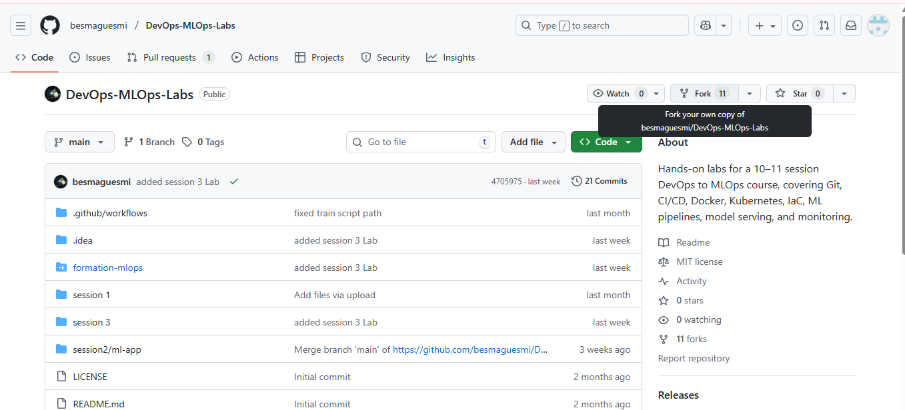
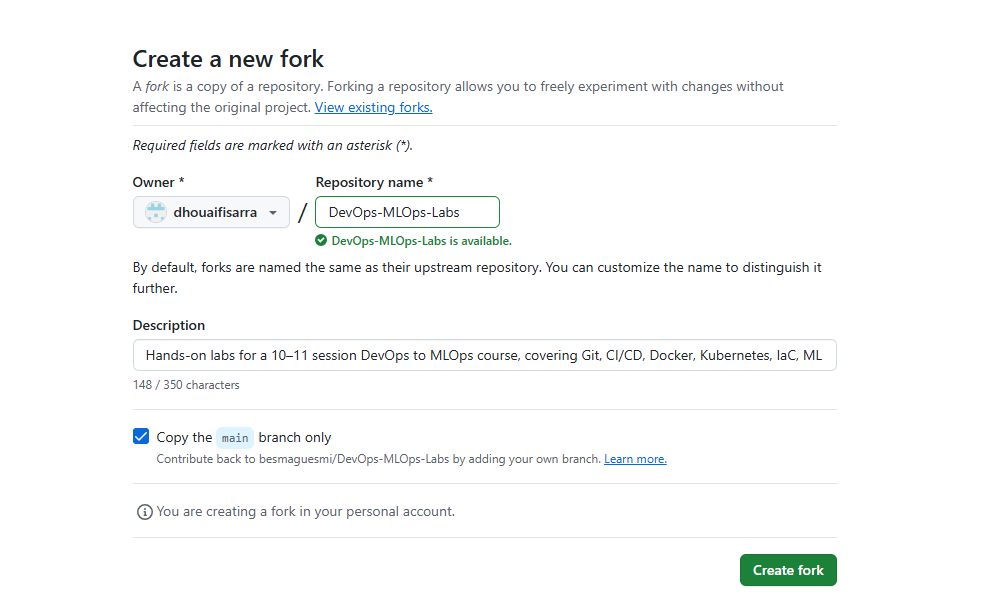
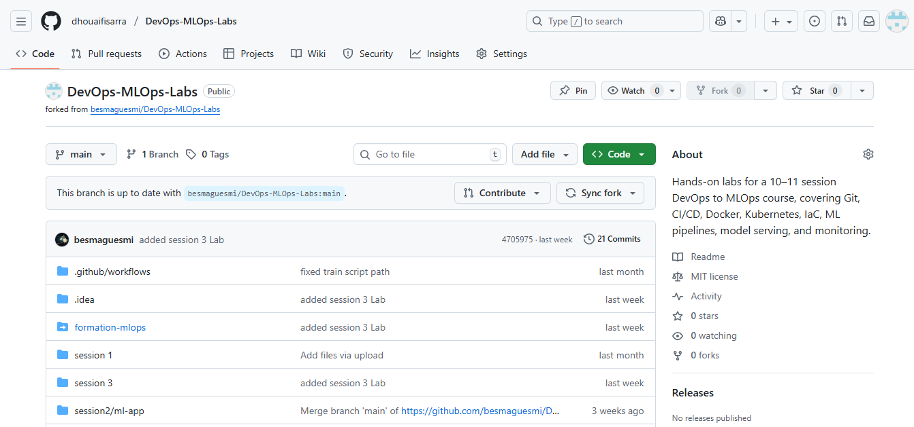

### 2. Inspect the repo structure
After forking, I cloned the repo locally using git clone and navigated into the folder session2/ml-app to inspect the file structure.
I verified that the project contains:   src/ folder and requirements.txt

Cloning the project : 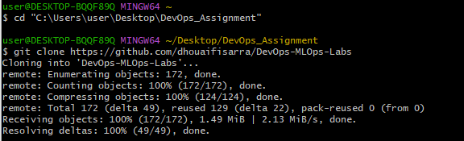
Inspecting the repo structure and makeing sure requirements.txt exists : 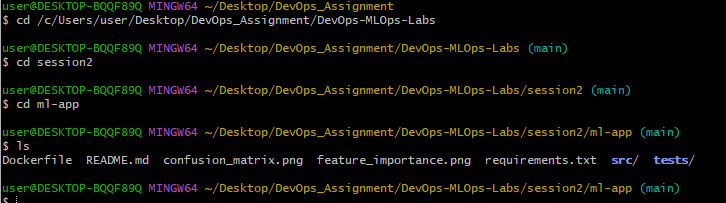

## Task 2: Run the app locally

### 1. Create a virtual environment & install dependencies
From inside session2/ml-app, I created and activated a virtual environment:
Installing Dependencies: 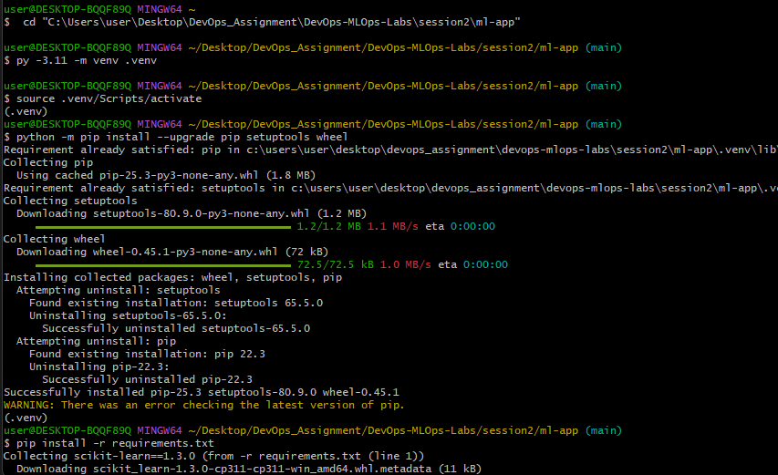

I executed the training script: This successfully generated:    models/iris_classifier.pkl
                                                                plots (confusion matrix, feature importance)
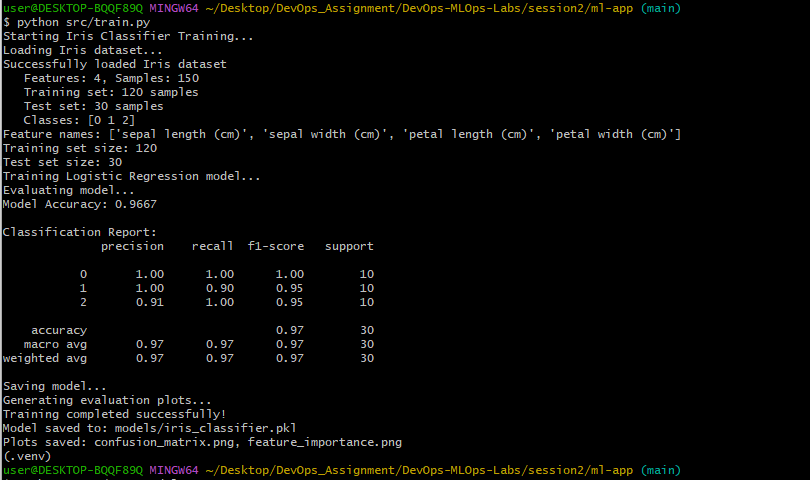

## Task 3: Write Unit Tests

### 1 & 2. Create tests/ folder with meaningful tests
The repository already contained a tests/test_model.py file with 6 meaningful unit tests, which was more than the 3 required. 

These tests verify:
Model initialization (test_model_initialization)

Model training (test_model_training)

Model prediction (test_model_prediction)

Model evaluation (test_model_evaluation)

Saving and loading the model (test_model_save_load)

Data loading (test_data_loading)

### 3. Running tests with pytest
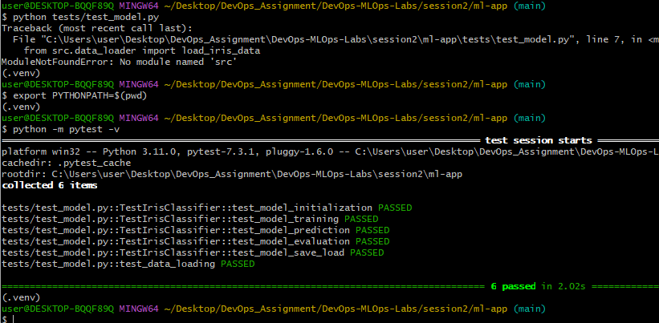

## Task 4: Linting & Formatting
### 1. Add a linter a minimal config.
I installed the linter and created a .flake8 file : 
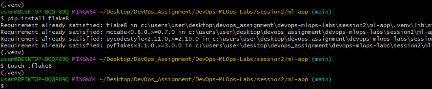
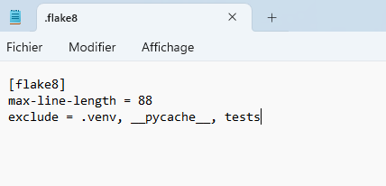
### 2. Ensure flake8 runs and the code meets basic style checks.
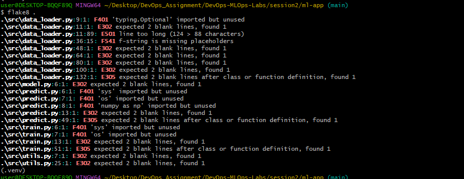

## Task 5: GitHub Actions CI Workflow
I created .github/workflows/ci.yml to automate: Checkout
                                                Setup Python
                                                Install dependencies
                                                Run flake8
                                                Run pytest
                                                Upload test results
                                                Build Docker image
                                                Upload Docker artifact
The pipeline ran successfully on GitHub.
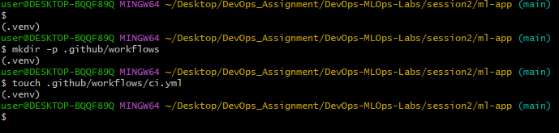
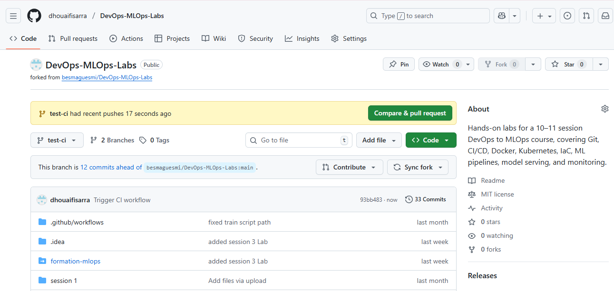
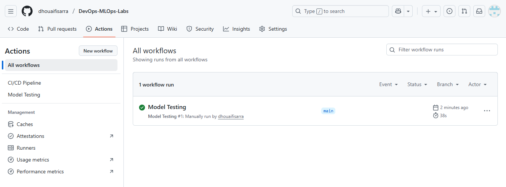

## Task 6: Containerize the Application
Build Docker Image : 
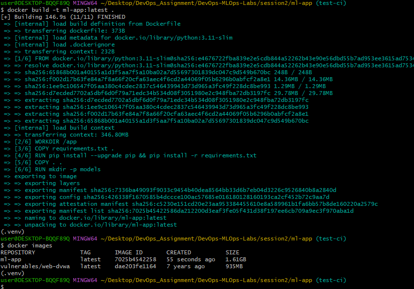

Run the Training Model inside Docker : 
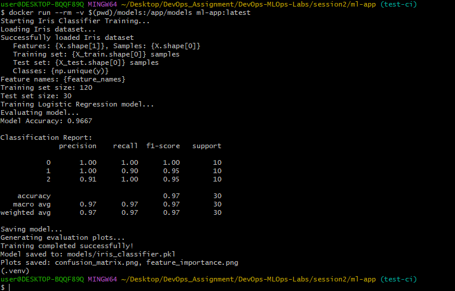
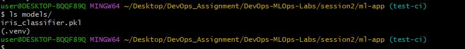