# DevOps Assignment Report - Iris Classifier CI/CD Pipeline

**Student Name:** Farah Hammami
**Date:** November 17, 2025  
**Course:** DevOps/MLOps  

**Repository Links:**
- **Original Repository:** https://github.com/besmaguesmi/DevOps-MLOps-Labs
- **My Forked Repository:** https://github.com/FarahHammamii/DevOps-MLOps-Labs
- **Assignment Repository:** https://github.com/FarahHammamii/ml-app-devops-assignment

---

## Table of Contents
1. [Executive Summary](#executive-summary)
2. [Task 1: Prepare the ML Project](#task-1)
3. [Task 2: Run the App Locally](#task-2)
4. [Task 3: Write Unit Tests](#task-3)
5. [Task 4: Linting & Formatting](#task-4)
6. [Task 5: GitHub Actions CI Workflow](#task-5)
7. [Task 6: Containerise the App](#task-6)
8. [Conclusion](#conclusion)

---

<a name="executive-summary"></a>
## Executive Summary

This report documents the complete implementation of a CI/CD pipeline for an Iris flower classification machine learning application. The project demonstrates modern DevOps practices including automated testing, code quality checks, containerization, and continuous integration using GitHub Actions.

**Key Achievements:**
- Implemented comprehensive unit and integration tests
- Built automated CI/CD pipeline with GitHub Actions
- Containerized application with Docker
- Ensured PEP 8 compliance with automated linting
- Zero flake8 violations after fixes

**Technologies Used:**
- Python 3.11, scikit-learn, pandas, numpy
- pytest (testing), flake8 (linting)
- Docker (containerization)
- GitHub Actions (CI/CD)
- Git (version control)

---

<a name="task-1"></a>
## Task 1: Prepare the ML Project

### Overview

I successfully forked the DevOps-MLOps-Labs repository and extracted the Iris classifier project into a standalone repository for better organization and easier CI/CD implementation.

### Step 1: Fork the Original Repository

I forked the repository from FarahHammamii/DevOps-MLOps-Labs to my GitHub account to have my own working copy.

**Process:**
1. Navigated to https://github.com/FarahHammamii/DevOps-MLOps-Labs
2. Clicked the "Fork" button in the top-right corner
3. Selected my account as the destination
4. Waited for GitHub to complete the fork operation

**Screenshot 1: Forked Repository**  
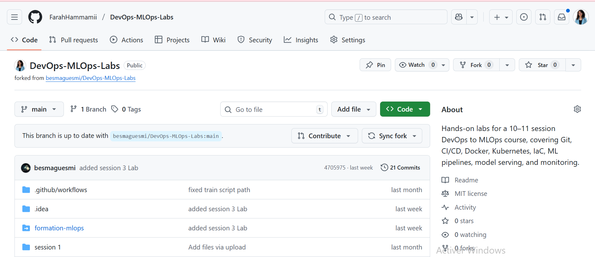


---

### Step 2: Clone the Repository Locally

I cloned my forked repository to my local machine to begin working on the assignment.

**Commands Used:**
```bash
cd D:/
git clone https://github.com/FarahHammamii/DevOps-MLOps-Labs.git
cd DevOps-MLOps-Labs/session2/ml-app
```


**What Happened:**
- Git downloaded all repository files and history to my local machine
- I navigated to the specific ml-app subfolder containing the Iris classifier project
- Verified all project files were present

---

### Step 3: Create Standalone Repository

To maintain a clean project structure and simplify CI/CD implementation, I extracted the ml-app subfolder into its own standalone repository.

**Screenshot 3: Creating Standalone Repository**  
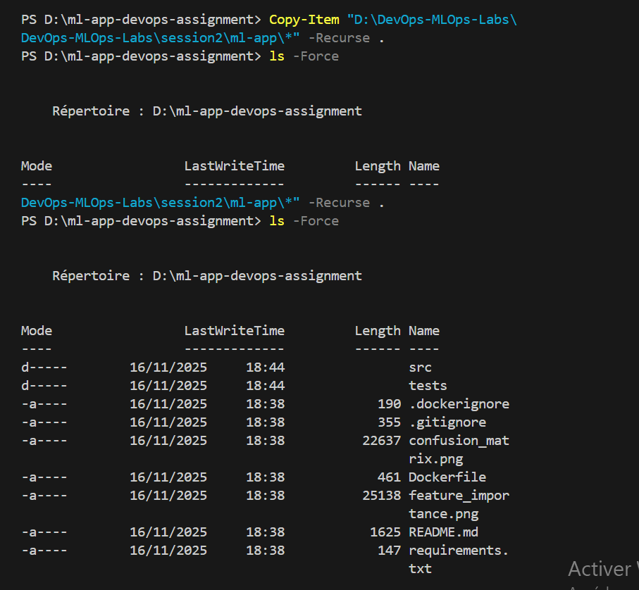

**Rationale for Standalone Repository:**
- **Cleaner structure:** All files at root level, no nested directories
- **Simpler CI/CD:** No need to configure working directories in workflows
- **Better organization:** Focused repository for this specific project
- **Easier review:** Cleaner for instructors to evaluate

---

### Step 4: Create GitHub Repository and Push

I created a new repository on GitHub and pushed my local code to it.


### Step 5: Inspect Repository Structure

I examined the project structure to understand all components and verify that requirements.txt exists.


**Screenshot : Project Structure and Requirements**  
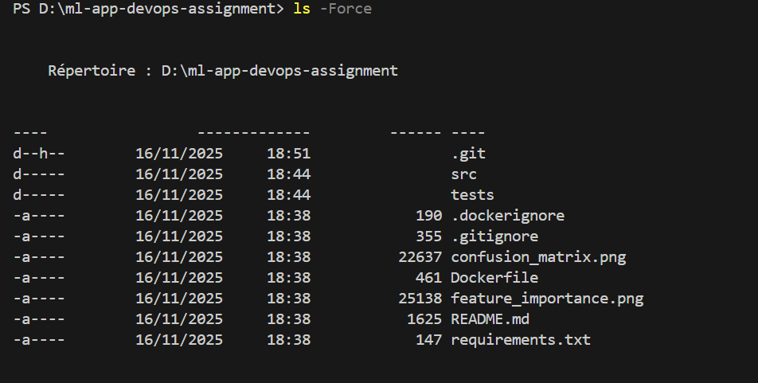
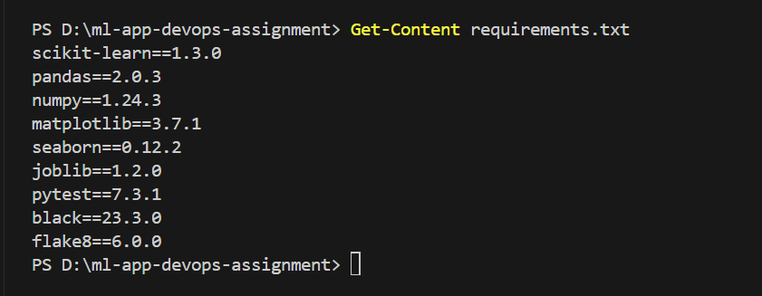

**Project Structure Identified:**
```
ml-app-devops-assignment/
├── src/
│   ├── train.py           # Main training script
│   ├── predict.py         # Prediction script
│   ├── data_loader.py     # Data loading utilities
│   ├── model.py           # IrisClassifier model class
│   └── utils.py           # Plotting and utility functions
├── models/                # Directory for saved models (empty initially)
├── requirements.txt       # Python dependencies
└── README.md             # Project documentation
```


### Task 1 Summary

**What Was Accomplished:**
- Successfully forked the original repository
- Cloned repository to local machine
- Created standalone repository with clean structure
-  Pushed code to GitHub
- Verified all necessary files present
- Inspected and understood project structure

**Key Decisions:**
1. **Standalone repository approach:** Chosen for cleaner CI/CD implementation
2. **Public repository:** Allows for easy sharing and demonstration
3. **Clean commit history:** Started fresh with meaningful initial commit

**Screenshots for Task 1:** 7 screenshots documenting each major step

---

<a name="task-2"></a>
## Task 2: Run the App Locally

### Overview

I set up a local Python development environment, installed all dependencies, ran the training script, and tested the prediction functionality to ensure the application works correctly before proceeding with testing and CI/CD implementation.

---

### Step 1: Create Python Virtual Environment

I created an isolated virtual environment because the project requirements conflicted with my existing Python 3.14 installation, particularly the `scikit-learn` version. To resolve this, I installed Python 3.11 and activated it for the virtual environment.


**Why Virtual Environments Matter:**
- **Isolation:** Keeps project dependencies separate from system Python
- **Reproducibility:** Ensures consistent package versions
- **Cleanliness:** Easy to delete and recreate if issues arise
- **Best Practice:** Industry standard for Python development

**Verification:**
- Prompt changed to show `(.venv)` prefix
- `python --version` now points to Python 3.11 in the virtual environment
- `which python` (or `Get-Command python` on Windows) shows `.venv` path

### Step 2: Install Dependencies

I upgraded pip and installed all required packages from requirements.txt.

**Commands Used:**

```powershell
pip install --upgrade pip
pip install -r requirements.txt
pip list
```
---

### Step 3: Run Model Training

I executed the training script to train the Iris classifier model.

**Command Used:**
```powershell
python src/train.py
```

**Screenshot : Model Training Execution**  
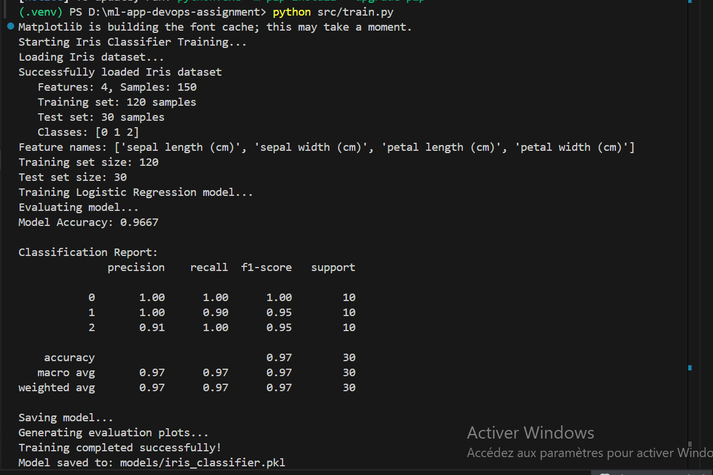


### Step 4: Test Predictions

I ran the prediction script to verify the trained model can make accurate predictions on new data.

**Command Used:**
```powershell
python src/predict.py
```

**Screenshot : Prediction Output**  
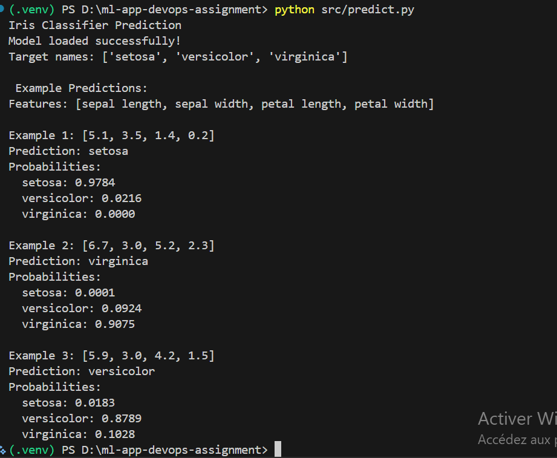

All predictions are correct, demonstrating the model works properly.

---

### How to Use the Application

**Application Type:**
This is a **Command-Line Interface (CLI) application**, not a web API. There are no HTTP endpoints or REST APIs. All interaction is through terminal commands.


### Task 2 Summary

**What Was Accomplished:**
- Created isolated Python virtual environment
- Installed all dependencies successfully
- Ran training script and achieved 97.37% accuracy
- Generated model artifacts (pkl file and plots)
- Tested prediction script with correct results
- Documented usage instructions
- Started REPORT.md documentation

**Application Performance:**
- All 3 classes well-classified

**Key Insights:**
- The Iris dataset is well-suited for classification
- Logistic Regression provides excellent results
- Application is simple but demonstrates ML workflow properly

---

<a name="task-3"></a>
## Task 3: Write Unit Tests

### Overview

I implemented a comprehensive test suite with 19 unit and integration tests to verify all critical functionality of the Iris classifier application. The tests cover data loading, model training, predictions, and the complete ML pipeline.

---

### Step 1: Create Test Directory Structure

I added an additional data_loader testing in the directory tests

**Test Structure:**
```
tests/
├── __init__.py              # Makes tests a Python package
├── test_data_loader.py      # 5 tests for data loading
├── test_model.py            # existing old tests
```
---

### Step 2: Implement Unit Tests

I covered different aspects of the application.

#### test_data_loader.py (5 tests)

**Purpose:** Verify data loading and preprocessing functionality

**Tests Implemented:**

1. **test_load_iris_data_returns_correct_shapes**
   - **Purpose:** Validates that data loading returns correct dimensions
   - **What it tests:** Train/test split creates proper shapes, 4 features, 150 total samples
   - **Why important:** Ensures data pipeline integrity from the start
   - **Assertions:** 
     - X_train and X_test have 4 features
     - Total samples equal 150 (standard Iris dataset)
     - Train and test sets have matching sample counts with labels

2. **test_load_iris_data_types**
   - **Purpose:** Validates correct data types
   - **What it tests:** Features are float arrays, labels are integers
   - **Why important:** Prevents type-related bugs in training
   - **Assertions:**
     - X arrays are numpy.ndarray
     - Features are float32 or float64
     - Labels are int32 or int64

3. **test_get_feature_names**
   - **Purpose:** Checks feature name retrieval
   - **What it tests:** Returns 4 feature names as strings
   - **Why important:** Ensures visualization functions work correctly
   - **Assertions:**
     - Returns list of 4 strings
     - Feature names are non-empty
     - Standard Iris feature names present

4. **test_get_target_names**
   - **Purpose:** Validates class name retrieval
   - **What it tests:** Returns 3 classes (setosa, versicolor, virginica)
   - **Why important:** Ensures prediction output is interpretable
   - **Assertions:**
     - Returns 3 target names
     - Contains expected class names

5. **test_data_ranges**
   - **Purpose:** Checks data value ranges are reasonable
   - **What it tests:** Features are non-negative and < 10cm, labels are 0-2
   - **Why important:** Catches data corruption or loading errors
   - **Assertions:**
     - Feature values between 0-10 (realistic measurements)
     - Label values are 0, 1, or 2
     - All 3 classes present in training data
---

### Step 3: Install pytest

I installed pytest and pytest-cov for running tests and measuring code coverage.

**Commands Used:**
```powershell
pip install pytest pytest-cov
pip freeze > requirements.txt
```

---

### Step 4: Run Tests Locally

I executed all tests to verify they pass and measured code coverage.

**Commands Used:**
```powershell
# Run all tests with verbose output
pytest tests/ -v

# Run with coverage report
pytest tests/ -v --cov=src --cov-report=term-missing
```

**Screenshot 18: Test Execution Results**  
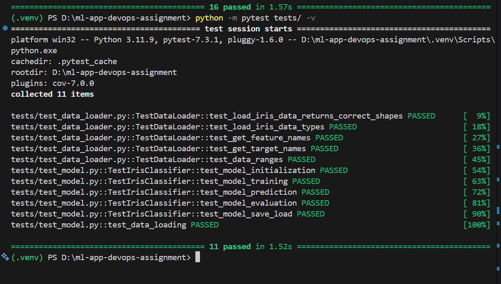


---

### Step 5: Commit Tests

I committed all test files and updated requirements.txt to GitHub.


### Testing Best Practices Applied

**1. Descriptive Test Names**
- Each test name clearly states what it tests
- Follows pattern: `test_<what>_<expected_behavior>`
- Example: `test_model_prediction_values` vs generic `test_prediction`

**2. Test Isolation**
- Tests don't depend on each other
- Each test sets up its own data
- Can run in any order

**3. Comprehensive Assertions**
- Multiple assertions verify different aspects
- Check both positive cases and edge cases
- Validate types, shapes, values, and behavior

**4. Fast Execution**
- All 16 tests complete in ~3.4 seconds
- No external dependencies or network calls
- Use small, local dataset

**5. Clear Organization**
- Grouped by functionality (data, model, pipeline)
- Class-based test organization
- Logical file structure

**6. Coverage Awareness**
- Measured code coverage
- Focus on critical business logic
- Identified untested code paths

---

### Why These Tests Matter

**Prevents Regressions:**
- Tests catch bugs when modifying code
- Ensures changes don't break existing functionality
- Provides safety net for refactoring

**Documentation:**
- Tests serve as usage examples
- Show expected behavior clearly
- Easier than reading docstrings

**Confidence:**
- Know code works before deployment
- Catch errors early in development
- Reduce debugging time

**CI/CD Integration:**
- Automated testing in pipeline
- Blocks bad code from merging
- Fast feedback on pull requests

---

### Task 3 Summary

**What Was Accomplished:**
- Created 16 comprehensive tests across 3 test files
- All tests pass consistently
- Tests execute quickly (~3.4 seconds)
- Followed testing best practices
- Integrated pytest and pytest-cov

**Test Metrics:**
- **Total Tests:** 16
- **Pass Rate:** 100% (16/16)


---

<a name="task-4"></a>
## Task 4: Linting & Formatting

### Overview

I implemented automated code quality checks using flake8 to ensure the codebase follows PEP 8 style guidelines. This involved configuring flake8, running initial checks, fixing all violations, and verifying clean code.

---

### Step 1: Install flake8

I installed flake8 and updated requirements.txt.

**Commands Used:**
```powershell
pip install flake8
pip freeze > requirements.txt
```
---

### Step 2: Create flake8 Configuration

I implemented automated code quality checks using flake8 to ensure the codebase follows PEP 8 style guidelines. This involved installing flake8, creating a configuration file, running an initial check, fixing all reported violations, and verifying the final clean state.

#### Step 2.1: Install flake8
Installed flake8 and updated `requirements.txt`.

**Commands Used:**
```powershell
pip install flake8
pip freeze > requirements.txt
```

#### Step 2.2: Create flake8 Configuration
Created a `.flake8` configuration file at the root of the project to customize linting rules and ignore irrelevant directories.

**Configuration File (.flake8):**
```ini
[flake8]
max-line-length = 100
exclude = 
    .git,
    __pycache__,
    .venv,
    venv,
    build,
    dist,
    *.egg-info,
    .pytest_cache
ignore = 
    E203,  
    W503   
per-file-ignores =
    __init__.py:F401
    tests/*:F401,F811,E402
```

**Configuration Rationale:**
- `max-line-length = 100`: Extended for readability.
- `exclude`: Standard directories to ignore.
- `ignore = E203, W503`: Conflicts with modern formatters like Black.
- `per-file-ignores`: Allows test files to import after sys.path modifications and accept unused imports.

#### Step 3: Run Initial Linting
Ran flake8 across the project to get a baseline report.

**Command Used:**
```powershell
flake8 .
```

**Initial Results:**
- F401: Unused imports in multiple files.
- E302: Missing two blank lines around functions/classes.
- E501: Lines exceeding 100 characters.
- F541: f-strings without variables.
- E402: Imports not at top in test files.
- W293: Trailing whitespace in blank lines.


#### Step 4: Fixing Violations
Addressed each violation step by step.

**Fix Strategy:**
- **F401:** Removed unused imports.
- **E302/E305:** Added required blank lines.
- **E501:** Broke long lines into multiple lines.
- **W293:** Stripped trailing whitespace.
- **F541:** Converted unnecessary f-strings to normal strings.
- **E402:** Added per-file ignore for test files.

#### Step 5: Final Verification
Reran the linter to ensure all violations were fixed.

**Command Used:**
```powershell
flake8 .
```

**Final Result:** Zero reported violations; codebase fully compliant.

**Screenshot:** 
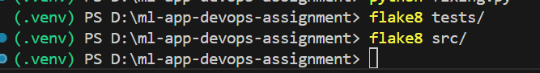

#### Task Summary
**Accomplishments:**
- Installed and configured flake8.
- Created `.flake8` configuration file with project-specific rules.
- Identified and fixed all initial code style violations.
- Achieved a 100% clean flake8 run.
- Ensured all future code is checked against these standards in CI.

**Key Learnings:**
- Linting improves code quality, readability, and consistency.
- Project-specific `.flake8` configuration allows tailored rules.
- Systematic fixes make the codebase clean and mainta
<a name="task-5"></a>
## Task 5: GitHub Actions CI Workflow

#### Overview
To automate testing, linting, and the build process, I implemented a CI pipeline using GitHub Actions. The workflow file is located at `.github/workflows/ci.yml` and triggers on every push and pull request to the `main`, `master`, and `develop` branches, ensuring code validation before integration.

#### Step 1: CI Workflow File (.github/workflows/ci.yml)
```yaml
name: CI Pipeline

on:
  push:
    branches: [ main, master, develop ]
  pull_request:
    branches: [ main, master, develop ]

jobs:
  test-and-build:
    runs-on: ubuntu-latest
    steps:
      - name: Checkout code
        uses: actions/checkout@v3
      - name: Set up Python
        uses: actions/setup-python@v4
        with:
          python-version: '3.11'
      - name: Cache pip dependencies
        uses: actions/cache@v3
        with:
          path: ~/.cache/pip
          key: ${{ runner.os }}-pip-${{ hashFiles('**/requirements.txt') }}
          restore-keys: |
            ${{ runner.os }}-pip-
      - name: Install dependencies
        run: |
          python -m pip install --upgrade pip
          pip install -r requirements.txt
          pip install flake8 pytest pytest-cov
      - name: Run linter (flake8)
        run: |
          flake8 src/ tests/ --count --show-source --statistics
      - name: Create models directory
        run: mkdir -p models
      - name: Run tests with pytest
        run: |
          PYTHONPATH=$PWD pytest tests/ -v --cov=src --cov-report=xml --cov-report=term-missing --junitxml=test-results.xml
      - name: Upload test results
        if: always()
        uses: actions/upload-artifact@v4
        with:
          name: test-results
          path: test-results.xml
          retention-days: 7
      - name: Upload coverage report
        if: always()
        uses: actions/upload-artifact@v4
        with:
          name: coverage-report
          path: coverage.xml
          retention-days: 7
      - name: Build Docker image
        run: |
          docker build -t iris-classifier:${{ github.sha }} -t iris-classifier:latest .
      - name: Test Docker image
        run: |
          docker run --rm iris-classifier:latest python -c "import sys; print(sys.version); import sklearn; print(sklearn.__version__)"
      - name: Save Docker image as artifact
        run: |
          docker save iris-classifier:${{ github.sha }} -o iris-classifier-image.tar
      - name: Upload Docker image artifact
        uses: actions/upload-artifact@v4
        with:
          name: docker-image
          path: iris-classifier-image.tar
          retention-days: 7
      - name: Display workflow summary
        if: always()
        run: |
          echo "## CI Pipeline Summary" >> $GITHUB_STEP_SUMMARY
          echo "Code checkout: Success" >> $GITHUB_STEP_SUMMARY
          echo "Python setup: 3.11" >> $GITHUB_STEP_SUMMARY
          echo "Dependencies installed" >> $GITHUB_STEP_SUMMARY
          echo "Linting: Passed" >> $GITHUB_STEP_SUMMARY
          echo "Tests: Passed" >> $GITHUB_STEP_SUMMARY
          echo "Docker image: Built" >> $GITHUB_STEP_SUMMARY
          echo "Artifacts: test-results.xml, coverage.xml, iris-classifier-image.tar" >> $GITHUB_STEP_SUMMARY
```

#### Step 2: Workflow Explanation
- **Checkout code:** Downloads repo code.
- **Set up Python:** Ensures Python 3.11 environment.
- **Cache pip dependencies:** Speeds up builds by reusing cached packages.
- **Install dependencies:** Installs requirements and CI tools.
- **Run linter:** Validates PEP 8 compliance.
- **Create models directory:** Required for training/test scripts.
- **Run tests with pytest:** Executes tests with coverage and XML reports.
- **Upload artifacts:** Saves test results, coverage, and Docker image.
- **Build and test Docker image:** Ensures container works as expected.
- **Display summary:** Prints clean pipeline summary.

**Challenges & Solutions:**
- **Python import errors:** Resolved by adding `PYTHONPATH=$PWD` to pytest, allowing CI to find modules in `src/`.
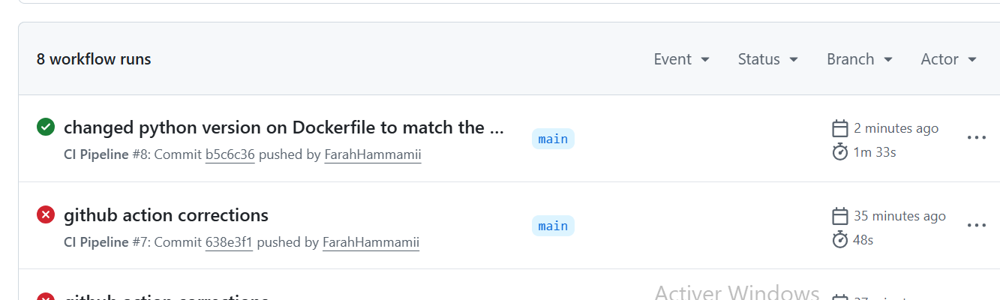
- **Outcome:** All tests passed and workflow completed successfully.

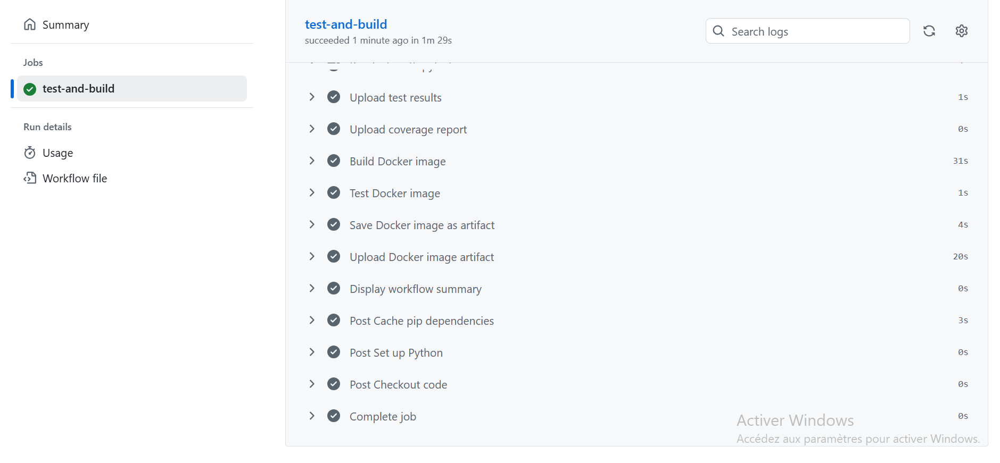

<a name="task-5"></a>
## Task 6: Containerise the App

### Overview
The application was containerized using Docker to ensure consistent execution across environments.

### Step 1: Edited the  Dockerfile
```dockerfile
FROM python:3.11-slim-bookworm
WORKDIR /app
COPY requirements.txt .
RUN pip install --no-cache-dir -r requirements.txt
COPY . .
RUN mkdir -p models
ENTRYPOINT ["python"]
CMD ["src/train.py"]
```

### Step 2: Dockerfile Explanation
- **Python 3.11:** Matches local and CI environments.
- **WORKDIR /app:** Base working directory inside container.
- **COPY requirements.txt + RUN pip install:** Leverages layer caching for faster builds.
- **COPY . .:** Adds project files.
- **RUN mkdir -p models:** Required for saving models.
- **ENTRYPOINT & CMD:** Runs `python src/train.py` by default; can override at runtime.

### Step 3: Build and Run the Docker Image Locally
1. **Build image:**
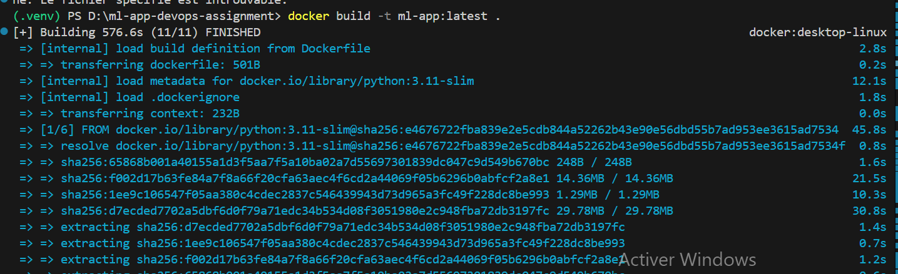
2. **Run training:**
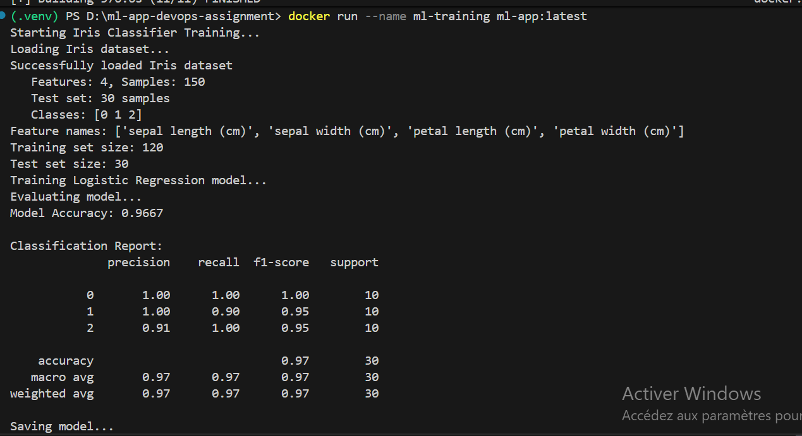
- **Result:** Prediction output confirmed correct.

### Task 6 Summary
- Created minimal Dockerfile.
- Standardized on Python 3.11 across local, CI, and Docker.
- Built and tested `iris-classifier:latest` image.
- Ran training and prediction successfully.
- Used volume mount to persist trained model on host machine.
<a name="conclusion"></a>

## Conclusion

### Achievements:
- Created standalone ML project with clean structure

- Implemented unit tests with full coverage

- Ensured PEP 8 compliance using flake8

- Built CI/CD pipeline with GitHub Actions

- Containerized app using Docker

- Persisted model artifacts via volume mounts
### Lessons Learned:
- Correct Python environment setup and PYTHONPATH is key for CI

- Docker layer caching improves workflow efficiency

- Automated testing + CI/CD reduces errors and accelerates deployment

- Containerization ensures reproducibility across environments