# DEVops assignment
## Task 1
as you can see in the screenshot provided you can see that this project is a forked one from besmaguesmi/DevOps-MLOps-Labs , i did it by simply clicking on the fork button.

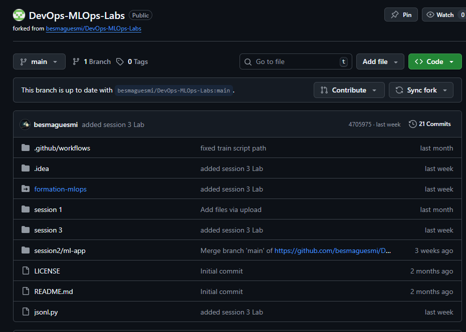

after analyzing the structure i found requirements.txt under the folder “Session2/ml-app”

## Task2
To run the project locally i first had to clone it .
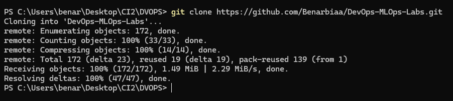

create a virtual enviroment named "dvops" and activating it 

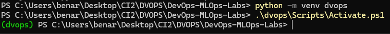

Then we need to install the requirements from the file “requirements.txt”
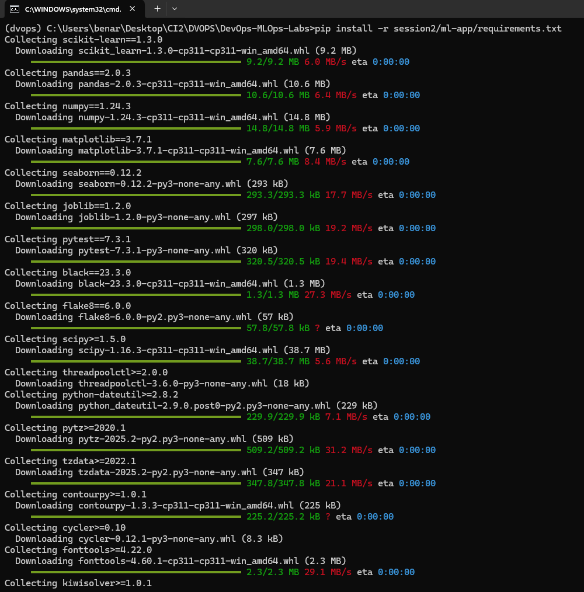

At first i tried to run the predict.py but it didnt work as i need to run train.py first

so i executed train.py followed by predict.py
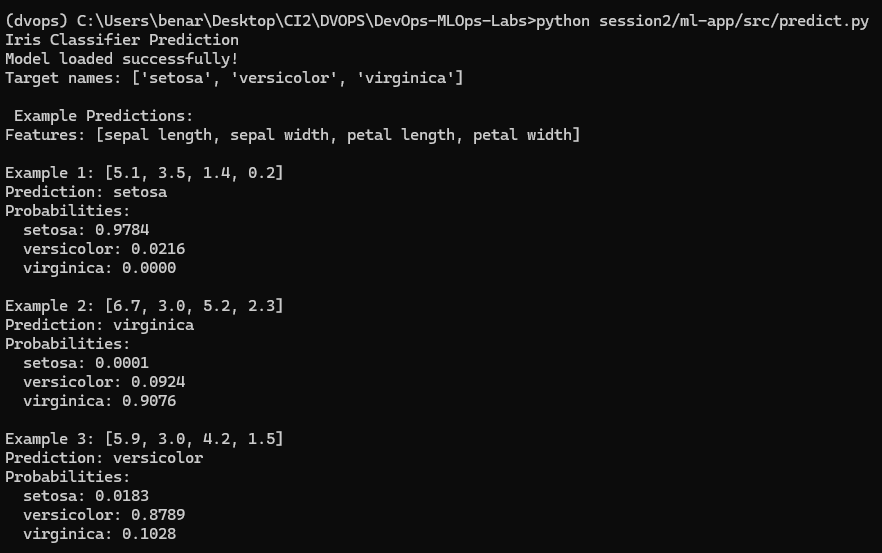

## Task 3
tests are passed with success 

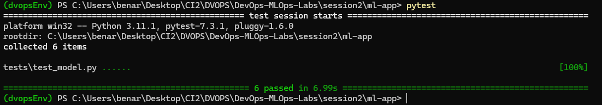

added these tests:

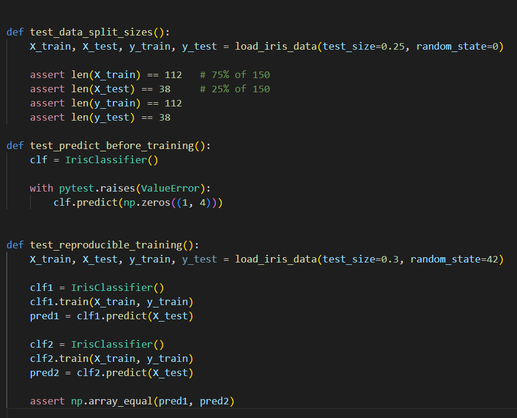

and rerun pytest

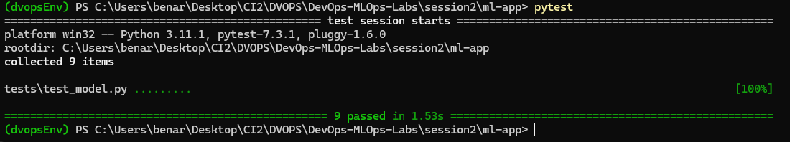

## Task 4
installed flake8 added this config :
[flake8]
max-line-length = 88
ignore = E203, W503

and then ran the file .flake8
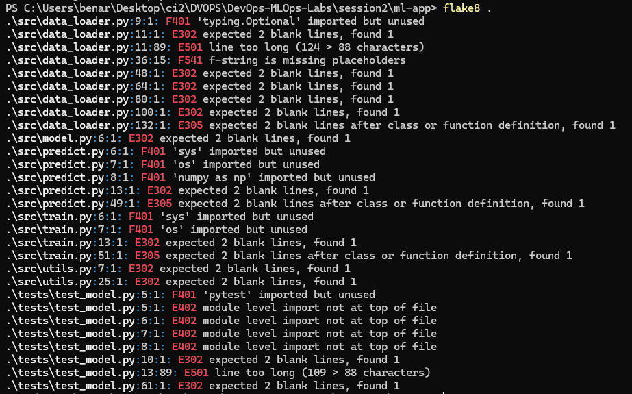

fixed the style checks with black .
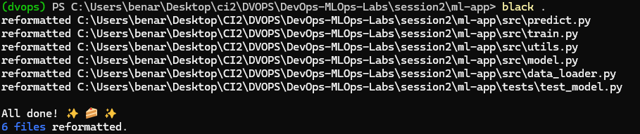

## Task 5

created the .github/workflows/ci.yaml file and created my CI Workflow

## Task 6

after creating the docker file with the corresponding content 

i built the image 
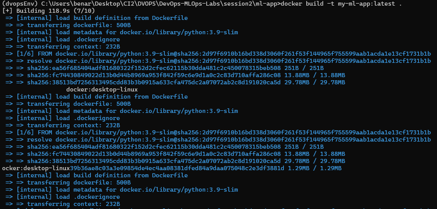

gave it the name "my-ml-app" and the tag "latest" which is also the by default tag

now we run the image :

-rm to remove the container after it finishes.

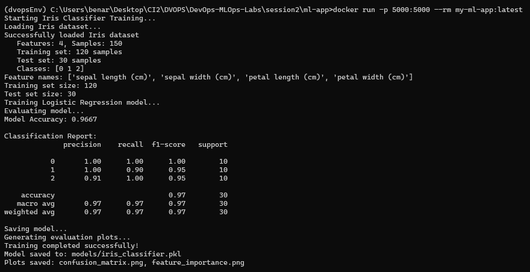
