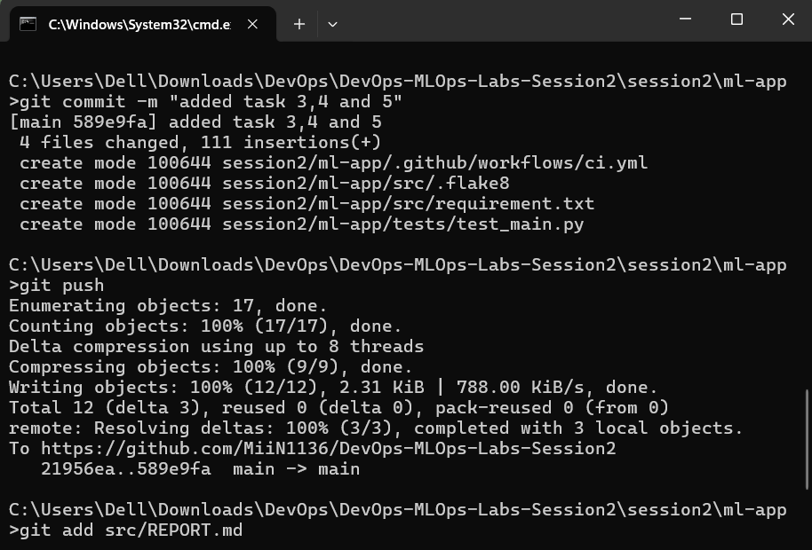

<h2>Task 3: Write unit tests</h2>
Description of what I did:

I confirmed that the project already included a complete set of unit tests in the `test_model.py` file. This file contains 6 meaningful tests that cover the core functionality of the IrisClassifier class and the data_loader module, including:

* test_model_training
* test_model_prediction
* test_data_loading

**Proof of execution:**

I ran the tests locally from my terminal using the pytest src/ command, as required. The screenshot below shows all tests passing successfully.

<h2>Task 4: Linting & formatting</h2>
Description of what I did:

I added `flake8` to the project to enforce code style and linting. First, I installed it in the virtual environment using `pip install flake8` and added it to requirements.txt using the command `pip freeze > requirement.txt`.

I then created a `.flake8` configuration file in the project root to set the max-line-length to 88 and to exclude `__init__.py` files from checks.

Finally, I ran the flake8 src/ tests/ command and fixed **all** reported style errors until the command returned no output, ensuring the code meets the style checks.

Proof of execution:
* output before fixing

* output after fixing

<h2>Task 5: GitHub Actions CI workflow</h2>
Description of what I did:

I created the necessary folder structure `.github/workflows/` and added a `ci.yml` file. This YAML file defines a CI pipeline that runs on **every push and pull_request** to the main branch, as required.

The workflow file contains a single job, build-and-test, which performs all the required steps:
1. Checkout code: Uses actions/checkout to get the repository code.
2. Set up Python: Uses actions/setup-python to install Python.
3. Install dependencies: Installs all packages from requirements.txt.
4. Run linter: Runs flake8 to check the code style.
5. Run tests: Runs pytest and generates an XML coverage report, which is then uploaded as an artifact using actions/upload-artifact.
6. Build and Upload Docker Image: Builds the Docker image and then saves it as a .tar file, which is uploaded as a run artifact.

Proof of execution:

<h2>Task 6: Containerise the app</h2>
Description of what I did:

I created a `Dockerfile` in the project's root directory to containerize the application. The Dockerfile uses a `python:3.11-slim` base image, sets a working directory, copies and installs the requirements.txt, and then copies the src directory. Finally, it sets the default command (CMD) to `python src/train.py`, which runs the training script when the container starts.

I verified this locally by first building the image using `docker build -t seance_2_mlapp` . and then running it with `docker run seance_2_mlapp`. The container ran successfully and produced the same output as running the script locally.

Proof of execution: