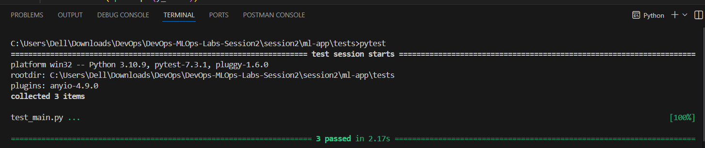
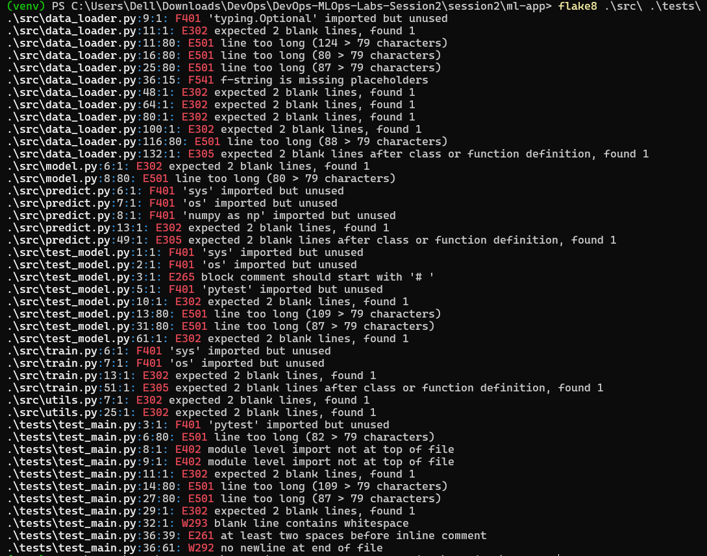
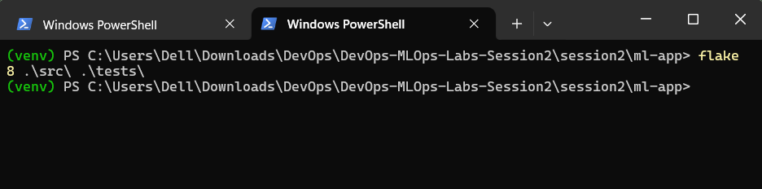

<h2>Task 3: Write unit tests</h2>
Description of what I did:

I confirmed that the project already included a complete set of unit tests in the `test_model.py` file. This file contains 6 meaningful tests that cover the core functionality of the IrisClassifier class and the data_loader module, including:

* test_model_training
* test_model_prediction
* test_data_loading

**Proof of execution:**

I ran the tests locally from my terminal using the pytest src/ command, as required. The screenshot below shows all tests passing successfully.

<h2>Task 4: Linting & formatting</h2>
Description of what I did:

I added `flake8` to the project to enforce code style and linting. First, I installed it in the virtual environment using `pip install flake8` and added it to requirements.txt using the command `pip freeze > requirement.txt`.

I then created a `.flake8` configuration file in the project root to set the max-line-length to 88 and to exclude `__init__.py` files from checks.

Finally, I ran the flake8 src/ tests/ command and fixed **all** reported style errors until the command returned no output, ensuring the code meets the style checks.

Proof of execution:
* output before fixing

* output after fixing
